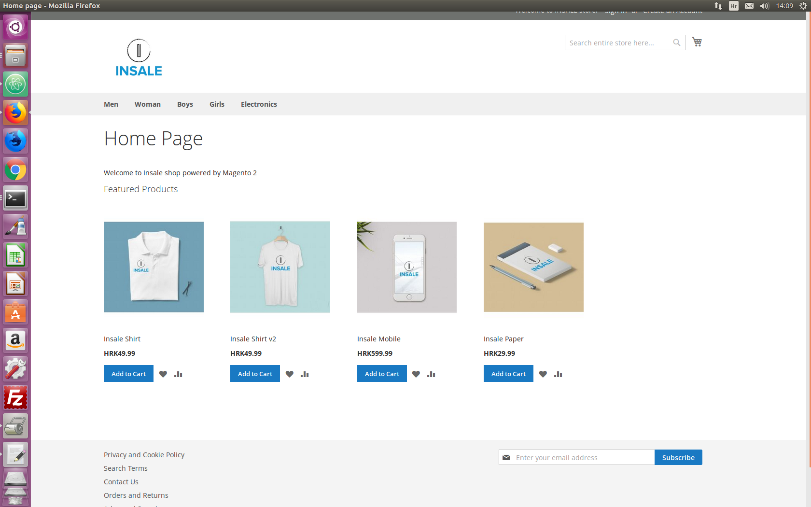

# Insale shop on Magento eCommerce Platform




Insale is a online-store, Magento 2 E Commerce website idea.

  - PHP
  - Magento 2


### Installation and PHP/MySQL versions

Installed [PHP 7.0.2](http://php.net/downloads.php) version.


```sh
$ adduser magento_user
$ sudo chown -R magento_user:magento_user
$ sudo nano /etc/ssh/sshd_config
```
PermitRootLogin no
```sh
/etc/init.d/ssh restart
```
Generate the SSL certificate for Apache using Certbot

To install MySQL 5.7 on Ubuntu 16:

    Enter the following command:

    sudo apt install -y mysql-server mysql-client


The readiness check makes sure your server and environment are set up correctly for updating, enabling, or disabling components. In the event of errors, you can consult troubleshooting suggestions in this [guide](http://devdocs.magento.com/guides/v2.1/comp-mgr/module-man/compman-readiness.html).


### Common issue


After installing, `.css .js .svg ` and Admin page not showing?

Had the same issue resolved by adding:

```sh
$ sudo nano /etc/apache2/apache2.conf
```


Modify:

<Directory /var/www/>
        Options Indexes FollowSymLinks
        AllowOverride None
        Require all granted
</Directory>

to this

<Directory /var/www/html>
        Options Indexes FollowSymLinks
        AllowOverride All
        Require all granted
</Directory>

You should also enable the mod_rewrite and insall ssl certificates apache2 module:

```sh
$ sudo a2enmod ssl
$ sudo a2ensite default-ssl
$ sudo a2enmod rewrite
$ sudo service apache2 restart
```


Success
```sh
For security, remove write permissions from these directories: '/var/www/html/app/etc'
```


Verify the deployment by navigating to your server address in your preferred browser.

```sh
http://127.0.0.1/Magento
```

## Meta

Domagoj Glavačević – glavacevic.d@gmail.com

[https://github.com/lodi432/]


License
----

 Magento Open Source is distributed under the Open Software License (OSL 3.0), and is thus open source software.

 Insale shop idea and design by Domagoj Glavačević


   [df1]: <https://laravel.com/>
# INSALE-shop-Magento2
